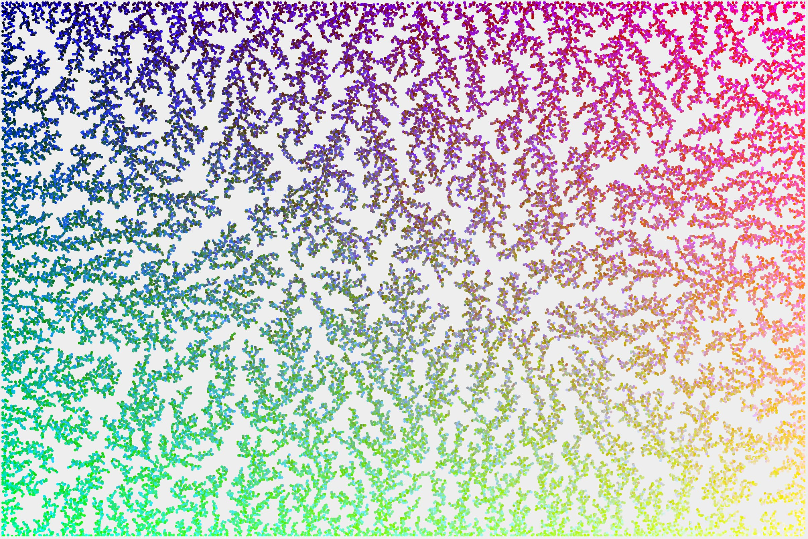
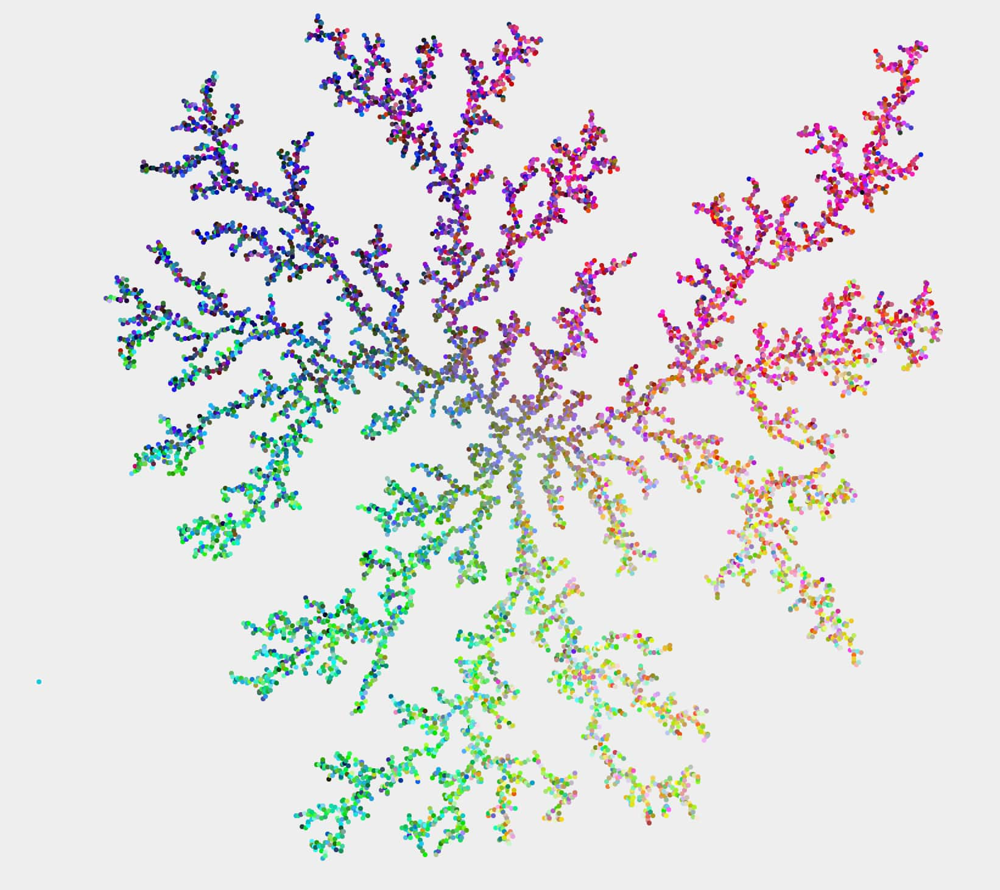

# Random dot simulator image creator

Generate interesting images with dots moving randomly.

- All dots are moving randomly.
- When a dot collides with a wall (or the center point) it sticks to it.
- When a dot collides with another stuck dot it sticks to it.

The result is an image with the dots sticking to each other interesting and beautiful ways. See the examples below.

